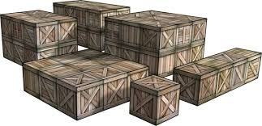

## Packages and Crates

The first parts of the module system we’ll cover are packages and crates.
A crate is a binary or library. 

> クレートは他の言語における「ライブラリ」や「パッケージ」と同じ意味



The *crate root* is a source file that the Rust
compiler starts from and makes up the root module of your crate (we’ll explain
modules in depth in the [“Defining Modules to Control Scope and
Privacy”][modules]<!-- ignore -->) section.

A *package* is one or more crates that provide a set of functionality.
A package contains a *Cargo.toml* file that describes how to build those crates.

> Package = Cargo (cargo.toml)


Several rules determine what a package can contain.
A package *must* contain zero or one library crates, and no more.
It can contain as many binary crates as you’d like,
but it must contain at least one crate (either library or binary).

Let’s walk through what happens when we create a package. 
First, we enter the command `cargo new`:

```text
$ cargo new my-project
     Created binary (application) `my-project` package
$ ls my-project
Cargo.toml
src
$ ls my-project/src
main.rs
```

When we entered the command, Cargo created a *Cargo.toml* file, giving us a
package.
Looking at the contents of *Cargo.toml*, there’s no mention of *src/main.rs* because Cargo follows a convention that *src/main.rs* is the
crate root of a binary crate with the same name as the package.
Likewise, Cargo knows that if the package directory contains *src/lib.rs*, the package contains a library crate with the same name as the package, and *src/lib.rs* is its crate root.
Cargo passes the crate root files to `rustc` to build the library or binary.

Here, we have a package that only contains *src/main.rs*, meaning it only
contains a binary crate named `my-project`. If a package contains *src/main.rs*
and *src/lib.rs*, it has two crates: a library and a binary, both with the same
name as the package. A package can have multiple binary crates by placing files
in the *src/bin* directory: each file will be a separate binary crate.

A crate will group related functionality together in a scope so the
functionality is easy to share between multiple projects. For example, the
`rand` crate we used in [Chapter 2][rand]<!-- ignore --> provides functionality
that generates random numbers. We can use that functionality in our own
projects by bringing the `rand` crate into our project’s scope. All the
functionality provided by the `rand` crate is accessible through the crate’s
name, `rand`.

Keeping a crate’s functionality in its own scope clarifies whether particular
functionality is defined in our crate or the `rand` crate and prevents
potential conflicts. For example, the `rand` crate provides a trait named
`Rng`. We can also define a `struct` named `Rng` in our own crate. Because a
crate’s functionality is namespaced in its own scope, when we add `rand` as a
dependency, the compiler isn’t confused about what the name `Rng` refers to. In
our crate, it refers to the `struct Rng` that we defined. We would access the
`Rng` trait from the `rand` crate as `rand::Rng`.

Let’s move on and talk about the module system!

[modules]: ch07-02-defining-modules-to-control-scope-and-privacy.html
[rand]: ch02-00-guessing-game-tutorial.html#generating-a-random-number
